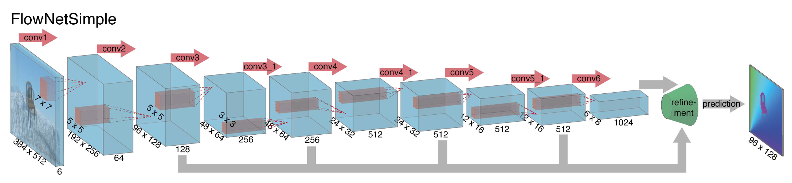
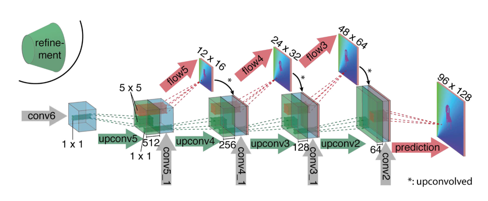
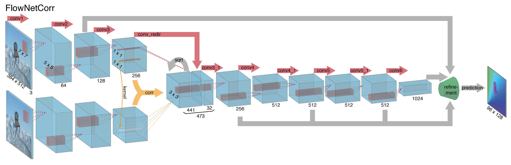
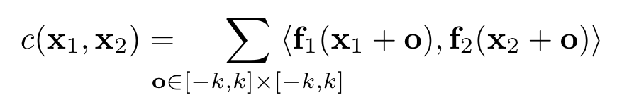
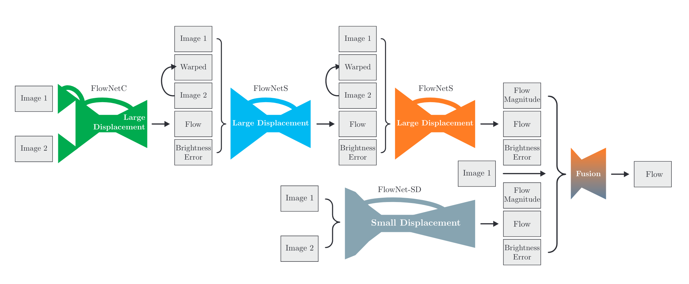

# FlowNet and FlowNet 2.0

FlowNet 是第一篇利用 CNN 直接做 Dense Optical Flow Estimation 的工作（End-to-end）。由于我们并没有一个真正的传感器去直接获取到光流，所以光流的数据集很少，且规模较小。KITTI 是一个常用的真实世界的数据集（自动驾驶场景），它是用激光雷达获取三维世界中的运动关系，再转换到二维图像的光流。这样操作首先会有一定的误差，其次这个数据集中给出 label 的像素也是相对比较稀疏的（大约只有 50% 的像素有 label）。FlowNet 的另外一个贡献就是提供了 Flying Chairs 这个合成数据集。

虽然 FlowNet 证明了用深度学习做光流预测是可行的，但是精度上来看并没有撼动传统方法的 SOTA 地位，特别是在小位移的情况下。FlowNet 2.0 在没有显著增加运算量的情况下，将误差大幅降低了超过 50%。这样，FlowNet 2.0 的精度可以和 SOTA 方法相比较，且速度更快。

 ## FlowNet-S

FlowNet-S 代表 FlowNetSimple，它的结构如下图所示：

整体的结构比较常规，输入是两张图像 stack 到一起，因此是 6 个 channel。随着卷积和 pooling 运算，feature map 的尺寸逐渐缩小（pooling 是必要的，不但加快训练速度，而且还将更大范围内的信息聚合）。因此最后还需要提供一个 refinement 网络来把图像尺寸放大，最后生成高分辨率的光流。

## Refinement

Refinement 网络的结构如下：

这里通过所谓 upconvolution 的操作来对 feature map 进行放大。Upconvolution 包含两个运算，一个是 unpooling，即 pooling 的反运算，跟随一个卷积运算。在放大的同时，还将之前的 feature map 和本次预测的低分辨率的光流一起叠加，从而实现 refine。每次放大都使图像尺寸扩大两倍。作者连续这样操作了 4 次，最终的图像仍比输入图像小了 4 倍。但是作者发现继续重复操作没有什么收益了，因此最后直接通过双线性插值的方法放大到输入尺寸。

## FlowNet-C

这里的 C 代表 Correlation。除了 FlowNet-S 之外，文章还提出了一个更 fancy 的结构：

上下两层网络应该是共享权重的，分别对两张图片做操作。给了两张图片的 feature map 之后，该怎么样去找到匹配呢？作者在这里设计了一个 correlation layer。两个像素 x1 和 x2 的 correlation 定义为，在周围的一个 patch 之内做内积，之后累加求和。

当然这样的运算的复杂度比较高。文章提出一个减少运算量的算法，即设定一个 max displacement D，只计算 x2 在 x1 周围一段距离内的数值，而不计算 x2 周围完整的 patch。当然这个时候 D 就变成了一个超参数。

## FlowNet 2.0

在 FlowNet 2.0 中，作者首先发现训练策略对精度的影响较大。其次，作者发现 FlowNetC 比 FlowNetS 更优。作者还改进了网络结构，将多个子网络进行了堆叠。特别是引入了 FlowNet-SD 来有针对性地解决小位移情况下精度不足的问题。网络结构如下：

其中，Warped 代表 Image2 根据生成的光流做 warp 后的结果。理想情况下，如果 flow 是完美的，Warped 应该和 Image1 一致。其误差即为图中的 Brightness Error。FlowNet-SD 在 FlowNet-S 上做了轻微的改动，但是单独在小位移的数据集上进行了训练。Fusion 是一个较为简单的结构，先把分辨率进行了压缩，之后缩放到原始大小。
